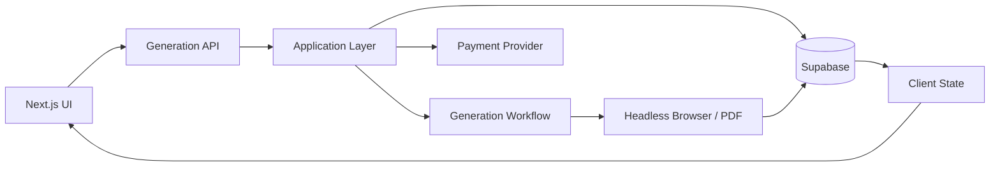

# FileGenPro

### Document & Content Generation Platform — Architecture Case Study

[Live platform](https://filegen.pro)

FileGenPro is a web platform for generating documents and content such as receipts, tickets, templates and social/chat mockups. It combines a Next.js application with server-side generation, browser automation, PDF output and payment flows.

The production source is private. This repository documents the engineering approach without exposing proprietary implementation.

## Architecture



## Core Stack

**Application:** Next.js, React, TypeScript  
**Data:** Supabase  
**State:** Zustand, TanStack React Query  
**Generation:** Puppeteer, Playwright  
**PDF runtime:** Headless Chromium  
**Deployment:** Vercel  
**Payments:** Stripe, Flutterwave  
**Email:** Nodemailer

## Engineering Challenges

### Document generation

Browser-based PDF generation is more expensive than ordinary application requests. Generation work is separated from the normal UI request path where appropriate.

### Rendering consistency

Generated documents depend on predictable browser rendering, fonts and layout. The generation layer controls the rendering environment and waits for required assets before producing the final output.

### Payment-dependent features

Monetized generation features require payment confirmation to be treated as a separate integration boundary before application state is updated.

### Client synchronization

After generation completes, the interface needs to know when an asset is ready. Server-state updates are reflected back into the client so users can retrieve generated output without manual refreshes.

## Example Lifecycle

```text
User submits generation request
          ↓
Input validation
          ↓
Generation work scheduled
          ↓
Headless browser / PDF compilation
          ↓
Generated asset persisted
          ↓
Client state updated
          ↓
User retrieves result
```

## Private Production Code

The production FileGenPro source is private. This public case study focuses on architecture, engineering decisions and system boundaries rather than proprietary source code.

